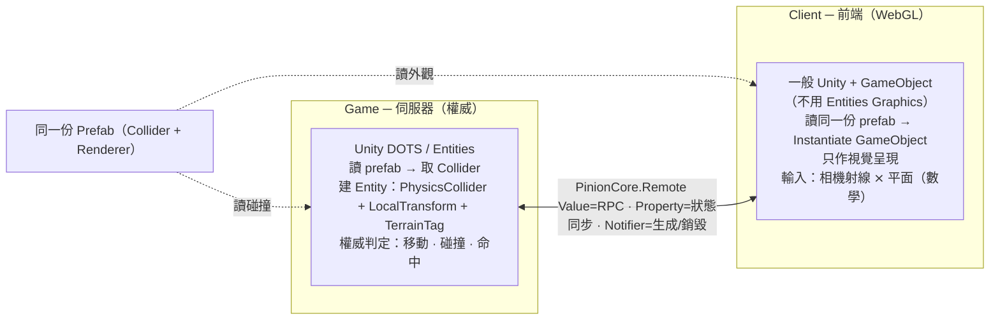
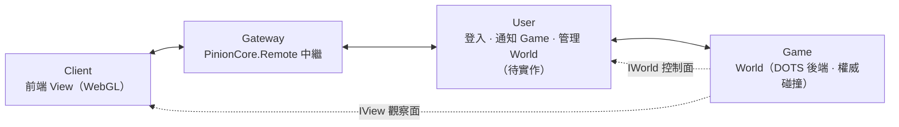

# Project2 開發技術指南
### DOTS 後端（權威計算）+ WebGL 前端（GameObject 呈現）+ PinionCore.Remote（同步）

> 一句話定位:**伺服器用 Unity DOTS 跑權威的碰撞/模擬,前端用一般 GameObject 在 WebGL 上呈現,兩邊讀「同一份 prefab」各取所需,靠 PinionCore.Remote 的 ghost 做同步。**

---

## 1. 架構總覽



核心觀念:**「模擬」與「呈現」是兩件事,而且在兩台機器上。** 伺服器只關心「地形踩不踩得到、角色能不能走到那、有沒有命中」;前端只關心「畫成什麼樣」。中間用 PinionCore.Remote 傳「事實」(誰在哪、發生了什麼),不傳畫面、也不傳 mesh。

---

## 1.1 部署拓樸(Client / Gateway / User / Game)

實際佈署拆成四個以 PinionCore.Remote 串接的角色:



| 角色 | 內容 | 職責 |
|---|---|---|
| **Client** | View(前端呈現) | 消費 ghost 畫地形/角色、收輸入;WebGL。 |
| **Gateway** | PinionCore.Remote 自帶 | 連線中繼/路由,接 Client 與後端服務。 |
| **User** | 待實作 | Client 登入、通知 Game、管理 World(生成/銷毀);控制面。 |
| **Game** | World(DOTS 後端) | 權威碰撞/模擬;對外暴露 World 的協定介面。 |

**介面對象(誰拿到哪個 facet):** 同一顆 Game 端的 `World`,對不同對象暴露不同介面:

- `IWorld`(控制面)→ 給 **User**:管理與控制 World。
- `IView`(觀察面)→ 給 **Client**:唯讀取資訊來繪製。

所以 `IWorld`/`IView` **要分開**,不是同一消費者的讀 vs 寫,而是**不同對象、不同信任邊界**(interface segregation by audience)。

---

## 2. 核心設計原則

1. **伺服器權威 (server authoritative)。** 所有會影響遊戲結果的判定(移動是否合法、碰撞、命中)只在伺服器 DOTS 世界裡算。前端送的是「請求」,不是「結果」。
2. **模擬資料 vs 呈現資料分離。** 碰撞/位置/狀態屬模擬(networked、權威、伺服器);mesh/material/動畫屬呈現(local、前端)。同步只走模擬資料。
3. **WebGL 不用 Entities Graphics。** WebGL 的渲染後端撐不起 BatchRendererGroup,所以前端**不靠 ECS 畫圖**,改用一般 GameObject。前端可以完全不是 DOTS。
4. **同一份 prefab 兩用。** `Terrain.prefab` / 角色 prefab 同時帶「碰撞」與「外觀」;伺服器只取碰撞、前端只取外觀。單一資產來源,避免兩邊對不上。
5. **協定與引擎解耦。** PinionCore.Remote 的協定介面(`IWorld` / `ICharacter`)只用可序列化的純資料型別,不直接塞 `UnityEngine.Vector3`、`Mesh` 這類引擎物件。

---

## 3. 三層職責切分

| 層 | 專案位置 (現況) | 相依 | 負責 | 不負責 |
|---|---|---|---|---|
| **後端 World (DOTS)** | `PinionCore.Project2.Worlds` | Entities、Unity.Physics、Transforms | 讀 prefab 取碰撞、建實體、跑權威模擬與碰撞判定 | 渲染、輸入、UI |
| **協定 (共用契約)** | `PinionCore.Project2.Protocols` | 只依賴 PinionCore.Remote | 定義 `IWorld`/`ICharacter` 等介面與可序列化資料型別 | 任何實作、任何引擎型別 |
| **前端 (WebGL 呈現)** | 尚未建立(建議 `PinionCore.Project2.View`) | 一般 UnityEngine、PinionCore.Remote client | 讀 prefab 建 GameObject、依 ghost 同步位置/生成銷毀、處理輸入 | 任何權威判定、物理模擬 |

> 重點:**後端 World 應該移除 `Unity.Entities.Graphics` 參考**(那是渲染,前端才需要),改加 `Unity.Physics`。目前 asmdef 裡先前加的 graphics 在這個分工下是多餘的。

---

## 4. 同一份 Prefab 的兩種用途

`Terrain.prefab`(以及未來的角色 prefab)天生同時帶了兩邊要的東西:

| Prefab 元件 | 誰用 | 用途 |
|---|---|---|
| `MeshCollider` / `BoxCollider` | **伺服器** | 取幾何 → 建 DOTS 碰撞實體(`PhysicsCollider`),作權威碰撞判定 |
| `MeshFilter` + `MeshRenderer` | **前端** | 直接 `Instantiate` 成 GameObject 當外觀 |
| `Transform` | 兩邊 | 初始位置(伺服器放進 `LocalTransform`,前端放進 GameObject transform) |

**伺服器端載入(概念):**

```csharp
// 讀 prefab → 取碰撞幾何 → 烘成 Unity.Physics 的 collider blob → 建實體
var collider = BuildPhysicsColliderFromMeshCollider(prefab); // BlobAssetReference<Collider>
var e = em.CreateEntity();
em.AddComponentData(e, LocalTransform.FromPosition(pos));
em.AddComponentData(e, new Unity.Physics.PhysicsCollider { Value = collider });
em.AddComponent<TerrainTag>(e);
// 注意:伺服器不加任何 RenderMesh / MaterialMeshInfo
```

> 效能提醒:伺服器要的是「夠用的碰撞」。地形若是平面或緩起伏,用 plane / box / heightfield 這類**簡化形狀**遠比整塊 mesh collider 便宜,射線與移動查詢會快很多。不必照搬美術用的 `MeshCollider`。

**前端載入(概念):**

```csharp
// 收到 ghost 通知「有新角色/地形」→ 讀同一份 prefab → 建 GameObject
var view = Object.Instantiate(prefab);       // 帶 MeshRenderer,直接能畫
// 之後每幀把 ghost 的 Position 同步到 view.transform
```

前端載入路徑要 WebGL 相容:不能用 `AssetDatabase`(Editor 限定)。用 **Resources / Addressables** 或直接把地形放進主場景。

---

## 5. PinionCore.Remote 協定設計

PinionCore.Remote 的三個同步原語,對應到遊戲語意:

| 原語 | 語意 | 遊戲用途 |
|---|---|---|
| `Value<T>` | 非同步 RPC 回傳 | 呼叫伺服器動作:`LoadTerrain()`、`MoveTo(target)` |
| `Property<T>` | 連續狀態,值變更會同步到 ghost | 角色位置、血量、狀態 |
| `Notifier<T>`(Supply/Unsupply) | 物件生成/銷毀 | 角色上線/離線 → 前端生成/銷毀 GameObject |

**協定介面(放在 `PinionCore.Project2.Protocols`,照 PinionCore.Remote 的 Chat1 慣例):**

```csharp
namespace PinionCore.Project2.Protocols.Worlds
{
    // 伺服器權威世界。前端透過 Agent.QueryNotifier<IWorld>().Supply 取得其 ghost。
    public interface IWorld : PinionCore.Remote.Protocolable
    {
        PinionCore.Remote.Value<bool> LoadTerrain();

        // 角色集合:Supply=有新角色、Unsupply=角色離開。
        // 前端據此生成/銷毀對應的 GameObject。
        PinionCore.Remote.Notifier<ICharacter> Characters { get; }
    }

    public interface ICharacter : PinionCore.Remote.Protocolable
    {
        // 讓前端知道要用哪個外觀 prefab(與具體 prefab 解耦)。
        PinionCore.Remote.Property<int> ViewId { get; }

        // 連續同步的位置。用純資料型別,不用 UnityEngine.Vector3。
        PinionCore.Remote.Property<Position> Position { get; }

        // 前端請求移動 → 伺服器判定合法性/碰撞 → 生效後反映在 Position。
        PinionCore.Remote.Value<bool> MoveTo(Position target);
    }

    // 協定專用、可序列化的位置型別(與引擎解耦)。
    public struct Position
    {
        public float X;
        public float Y;
        public float Z;
    }
}
```

**前端訂閱(概念,對照 Chat1 的 `Console.cs`):**

```csharp
// 1) 取得世界 ghost
Agent.QueryNotifier<IWorld>().Supply += world =>
{
    // 2) 訂閱角色生成/銷毀
    world.Characters.Supply   += OnCharacterEnter; // → Instantiate prefab(依 ViewId)
    world.Characters.Unsupply += OnCharacterLeave; // → Destroy GameObject
};

// 3) 每幀把 ghost 的 Position 同步到 GameObject(可用 UniRx 的 PropertyChangeValue)
//    character.Position 變更 → view.transform.position = ...
```

> 對照上一個 Netcode sample:它的「ghost prefab + PlayerViewSystem」在 Project2 裡換成「`Notifier<ICharacter>` + 前端訂閱 Supply 生 GameObject」。差別只在同步框架不同(Netcode for Entities → PinionCore.Remote),**切分方式完全一樣**。

---

## 6. 端到端資料流

**A. 角色生成(玩家上線)**

```
前端連線 → 伺服器建立 ICharacter 並 Supply
        → 前端 Characters.Supply 觸發
        → 前端讀 prefab(依 ViewId)Instantiate GameObject
        → 之後靠 Position 同步
```

**B. 移動(伺服器權威)**

```
前端點擊 → 相機射線 ⨯ 地面平面(y=0)數學交點 → target
        → character.MoveTo(target)  [RPC, Value<bool>]
        → 伺服器 DOTS:檢查合法性 + 碰撞,更新該實體 LocalTransform
        → 伺服器把新位置寫進 Property<Position>
        → 同步到前端 ghost → 前端把 GameObject 移到新位置
```

**關鍵:** 前端**永遠不自己決定**角色最終位置。它送請求、畫伺服器回來的結果。點擊判定用數學平面(不靠前端物理),對 WebGL 友善。

---

## 7. 組件與 asmdef 切分

| Assembly | references | 說明 |
|---|---|---|
| `PinionCore.Project2.Protocols` | 只有 PinionCore.Remote | 純介面 + 資料型別,兩邊共用,不碰引擎 |
| `PinionCore.Project2.Worlds`(後端) | Unity.Entities、**Unity.Physics**、Unity.Transforms、Unity.Collections、Unity.Mathematics、Unity.Burst | **移除 Unity.Entities.Graphics**;只做碰撞/模擬 |
| `PinionCore.Project2.View`(前端,新建) | UnityEngine、PinionCore.Remote client、Protocols | GameObject 呈現 + 輸入;不碰 Physics/Entities |

原則:**讓每一邊 build 出來只帶自己需要的東西。** 後端不該把渲染程式碼編進去;前端不該白扛 DOTS 物理。協定夾在中間,誰都能參考、但它誰都不依賴。

---

## 8. 驗證與測試策略

延續「驗證靠狀態、不靠回傳值」的原則,每一層測自己的關注點:

| 層 | 測什麼 | 怎麼斷言 |
|---|---|---|
| 後端 World | 讀 prefab 後,DOTS 世界真的多了碰撞實體 | 查 `TerrainTag`/`CharacterTag` 實體數,且帶 `PhysicsCollider` + `LocalTransform` |
| 協定契約 | RPC 有完成且回報成功 | `Value<T>` 在超時內 `HasValue()` 且值正確(用 UniRx `RemoteValue()` 等待) |
| 前端呈現 | 收到 Supply 後真的生出對應 GameObject,位置跟著 Property 走 | 場景中出現對應物件;改 `Position` 後 view.transform 同步 |

測試世界隔離:後端測試用 `new World()` 自建獨立 DOTS 世界(`world.Dots`),`Dispose()` 釋放,避免污染。後端測試屬 **PlayMode**(目前 `Tests.asmdef` 設定被歸為 PlayMode)。

補充測試方向:失敗路徑(prefab 不存在 → `Value` 回 false 且無殘留實體)、冪等(重複 `LoadTerrain` 的預期行為)。

---

## 9. WebGL 平台注意事項

1. **不支援 Entities Graphics(BatchRendererGroup)。** 前端渲染一律走 GameObject。若未來想在前端用 ECS 渲染,需押 WebGPU 路線,屬實驗性,先別依賴。
2. **單執行緒。** WebGL 沒有 job 多執行緒;重運算(物理、AI)留在伺服器,前端盡量輕。
3. **輸入用數學、少用物理。** 點擊/瞄準用射線與平面/包圍盒的數學交點,避免在前端跑預測物理。
4. **資產載入。** 不能用 `AssetDatabase`;用 Resources / Addressables,或把靜態內容(地形)直接放主場景。
5. **傳輸。** WebGL 只能用 WebSocket;確認 PinionCore.Remote 的 client 傳輸層在 WebGL 下用的是 WebSocket。

---

## 10. 待辦事項與風險

**已完成**

- [x] 安裝 `com.unity.physics`(6.5.0)。
- [x] 後端 `Worlds.asmdef` 移除 `Unity.Entities.Graphics`、加入 `Unity.Physics`。
- [x] 後端 `World` 改為碰撞:取 `MeshCollider`/`MeshFilter` 幾何 → 烘 `PhysicsCollider` 實體(`PhysicsCollider` + `LocalTransform` + `PhysicsWorldIndex` + `TerrainTag`),完全不加渲染元件。
- [x] 地形載入改用 `Resources`:prefab 移到 `Assets/Resources/`,以 `Resources.Load("Terrain")` 載入。PlayMode 測試已改斷言 `PhysicsCollider` 並通過。
- [x] `World` 收斂職責:改吃 `WorldInfo`、自建獨立 `Unity.Entities.World`(不注入預設世界),`LoadTerrain` 於建構時執行。

**待辦**

- [ ] **定義/實作 `IActor` 伺服器端**:目前 `Actor` 為 `NotImplementedException`(`PrototypeId`/`EntityId`/`OnPathChanged`/`Move`)。
- [ ] **角色生成/銷毀通道**:用 `Notifier<IActor>` 讓前端 spawn/despawn 對應 GameObject。
- [ ] **建立前端 View**:消費 `IView`/`IWorld` ghost、prefab→GameObject、處理輸入(獨立 assembly,見第 7 節)。
- [ ] **命名/職責釐清**:`World`/`View`/`IWorld`/`IView` 的對稱與分層(見第 12 節)。
- [ ] **確認 PinionCore.Remote client 在 WebGL 用 WebSocket 傳輸。**
- [ ] **WebGL 正式版載入策略**:評估 Addressables / SubScene 取代 `Resources`。
- [ ] **效能(延後)**:World 銷毀採「重用 + 清內容」還是「重建」,依頻率與網路身分需求決定;blob 需自行釋放。

風險點:WebGL 上 DOTS/WebGPU 支援度變動快,任何「前端用 ECS 渲染」的想法都要先做最小驗證 build 才能押。

---

## 11. 詞彙對照(Netcode sample ↔ Project2)

| Netcode for Entities sample | Project2(PinionCore.Remote) |
|---|---|
| Ghost prefab(純邏輯,無 renderer) | 伺服器 DOTS 實體(碰撞 + tag,無 renderer) |
| `PlayerViewSystem`:ghost → GameObject | 前端訂閱 `Notifier<ICharacter>.Supply` → Instantiate prefab |
| RPC `MoveTargetRequest` | `ICharacter.MoveTo(Position)` 回 `Value<bool>` |
| Ghost 同步的 `LocalTransform` | `ICharacter.Position`(`Property<Position>`) |
| ClientWorld / ServerWorld 分離 | 前端(一般 Unity)/ 伺服器(DOTS)分離 |
| 點擊:射線 ⨯ 平面(數學,WebGL 友善) | 同左(照搬) |

---

## 12. 命名與職責分層(建議)

**更新(以此為準):** `IWorld` 是給 **User** 的**控制面**、`IView` 是給 **Client** 的**觀察面**——兩者服務**不同對象**,所以**分開是對的**(interface segregation by audience);先前「合併」的建議作廢。同一顆 Game 端的 `World` 同時實作這兩個 facet。

剩下值得斟酌的三個純命名/結構細節:

1. **前端類別 `View` vs 協定 `IView` 不是「實作對」。** 實作 `IView` 的是 Game 的 `World`;Client 的 `View` 只是**消費** `IView` ghost。因為 `IView` 現在明確是「給 View/Client 的 facet」,可接受;若要零歧義,協定可叫 `IWorldView`、Client 類別叫 `WorldView`。
2. **`IWorld : IView` 的繼承 =「控制面包含觀察面」。** User 若本來就要觀察世界則合理;若要嚴格區隔兩個對象看到的成員,改成**兄弟**(各自 `Protocolable`,`World` 同時實作)。
3. **`WorldInfo`(ScriptableObject 設定)→ 建議改名 `WorldConfig`**,與「可觀察的世界資訊」區隔。

建議 namespace 對齊部署角色(第 1.1 節):`Protocols`(共用契約:`IWorld` 控制 / `IView` 觀察 / `IActor` / `Path`)、`Worlds`(Game 端:`World : IWorld, IView`、`Actor`、`WorldConfig`)、`View`(Client 端:`View`/`WorldView`、`ActorView`)、`User`(未來 User 端)。

> 注意:下方「建議命名」區塊為早期草稿,其中把 `IWorld` 標為觀察面、另立 `IWorldControl`,與本專案最終決定(`IWorld`=控制、`IView`=觀察)**相反**,請以上方為準。

根因:名字把**三條互相垂直的軸**混在一起了。建議各用各的手段分:

| 軸 | 用什麼區分 |
|---|---|
| 契約 vs 實作 | 介面 `I...` 前綴 vs 類別(已有) |
| 伺服器 vs 前端 | **namespace 分層**,不要用型別名硬扛 |
| 觀察 vs 控制 | 用**能力**命名介面,不要借用「View」 |

**建議命名(能力命名 + namespace 分層):**

```
PinionCore.Project2.Protocols          // 共用契約
  IWorld                 // 世界的可觀察/唯讀面(Name、地形資訊、Notifier<IActor> 角色清單)
  IWorldControl : IWorld // 需要時再疊上權威指令(可選,若前端只給唯讀)
  IActor, Path

PinionCore.Project2.Worlds  (或 .Server)   // 後端 DOTS 實作
  World : IWorldControl
  Actor : IActor
  WorldConfig            // ← 原 WorldInfo 改名,凸顯它是設定而非可觀察資訊

PinionCore.Project2.View  (或 .Presentation / .Client)  // 前端呈現
  WorldView   (或 WorldPresenter / WorldRenderer)  // 消費 IWorld ghost、prefab→GameObject
  ActorView
```

**核心原則:「View」是前端的一個『呈現者』角色,它是類別、不是協定。** 協定用能力命名(觀察 `IWorld` / 控制 `IWorldControl`),就不會出現「`IView` 被 `World` 實作、卻被 `View` 消費」的錯亂。namespace 分層(Protocols / Server / View)本來就該做,分層後名字還能更短;但 namespace 修不掉上面的語意誤導——那要靠改名。

> 若你偏好保留「唯讀切面」的概念,把 `IView` 改名為 `IWorldObservable` / `IReadOnlyWorld` 也行,重點是**別讓協定名跟前端類別名同字**。

---

*本指南描述目標架構,部分項目(見第 10 節)尚未實作。*
